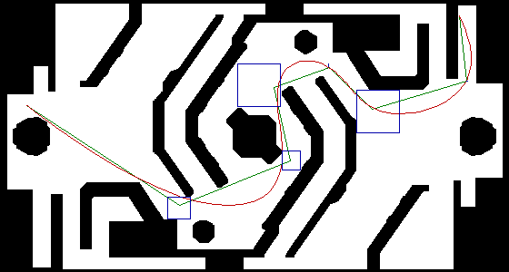

# TDT哨兵导航前后端

这是一个面向二维栅格地图的算法组件，组件提供前端路径搜索、动力学搜索和后端轨迹优化等基础模块，可以根据实际工程需要选择其中的一部分接入。

## 效果展示


## 组件内容

- `YAstar`：前端算法，包括普通Astar和Kinodynamic Astar两种搜索算法，支持二维栅格地图的路径规划。
- `MinimumSnapOsqp`：后端算法，可选闭式求解与OSQP求解器求解。

## 目录结构

```text
.
├── src/                            # 组件源码
│   ├── YAstar/                     # 前端算法
│   |   ├── yastar.hpp              # 普通astar算法
│   |   ├── yastar.cpp              # 普通astar算法
|   |   ├── kinodynamicAstar.hpp    # kastar算法
│   |   └── kinodynamicAstar.cpp    # kastar算法
│   └── MinimumSnapOsqp/            # 后端算法
│        ├── minimumSnap.hpp        # Minimum Snap轨迹优化
│        ├── minimumSnap.cpp        # Minimum Snap轨迹优化
|        ├── sfcSquare.hpp          # 方形约束生成
|        └── sfcSquare.cpp          # 方形约束生成
├── 3rd/                            # OSQP 与 OsqpEigen 子模块
├── doc/                            # 算法说明
├── images/                         # 示例地图和文档图片
├── scripts/setup.sh                # 环境配置脚本
├── main.cpp                        # 使用示例
└── CMakeLists.txt                  # 示例构建配置
```

## 环境配置

核心依赖为支持C++11的编译器、Eigen3、OSQP和OsqpEigen。OSQP 与 OsqpEigen以固定版本作为子模块放在 `3rd` 目录中，运行环境配置脚本即可完成依赖安装、子模块初始化和依赖构建：

```bash
./scripts/setup.sh
```

脚本会将 OSQP 和 OsqpEigen 构建并安装到 `3rd/install`。OpenCV只用于 `main.cpp` 示例中的图片读取和可视化，不属于算法组件的核心依赖，需要运行示例时再自行安装。

## 使用示例

`main.cpp`只是一个使用示例，实际工程可以根据需要引入 `src` 中的组件源码。
运行 `main.cpp` 示例：

```bash
mkdir build
cd build
cmake ..
make -j4
./play
```

运行结果：


其中：
- 绿色折线为前端搜索后化简的路径。
- 蓝色框为后端优化最终使用的走廊。
- 红色曲线为后端优化的最终轨迹。

## 文档

- [`doc/Astar.md`](doc/Astar.md)：Astar 和 Kinodynamic Astar 的原理与规划思路。
- [`doc/MinimumSnap.md`](doc/MinimumSnap.md)：Minimum Snap 的数学建模、求解和碰撞处理。
- [`doc/Usage.md`](doc/Usage.md)：使用文档。

## 联系作者
1. SnifferCaptain
    - qq: 3586554865
    - email: 3586554865@qq.com
    - github: https://github.com/SnifferCaptain
2. Nathongc
    - qq: 738607264
    - github: https://github.com/Nathongc

## Third-party

| project | description | license |
| --- | --- | --- |
| [OSQP](https://github.com/osqp/osqp) | 二次规划求解器 | [Apache-2.0](https://github.com/osqp/osqp/blob/master/LICENSE) |
| [OsqpEigen](https://github.com/robotology/osqp-eigen) | OSQP 的 Eigen C++ 封装 | [BSD-3-Clause](https://github.com/robotology/osqp-eigen/blob/master/LICENSE) |
| [Eigen](https://gitlab.com/libeigen/eigen) | A C++ template library for linear algebra | [Mozilla Public License Version 2.0](https://gitlab.com/libeigen/eigen/-/blob/master/LICENSE) |

Eigen3 和 OpenCV 是外部依赖，许可证请以各自安装版本附带的许可证为准。

## License

使用 [MIT](LICENSE) 许可证，SnifferCaptain and Nathongc