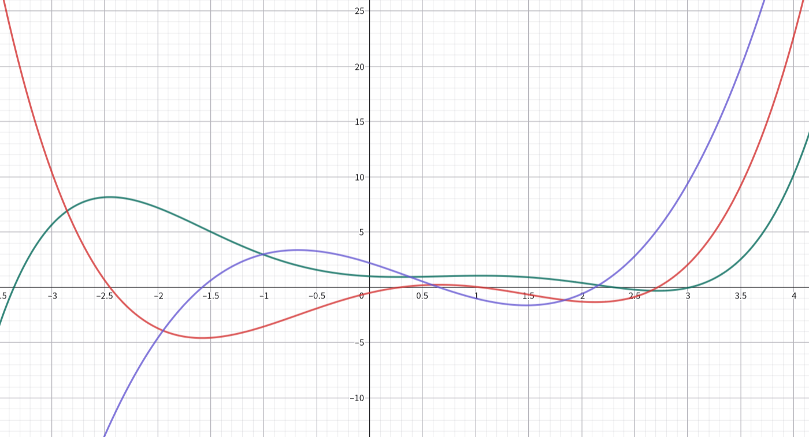
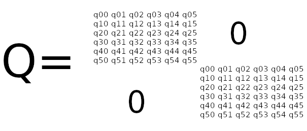
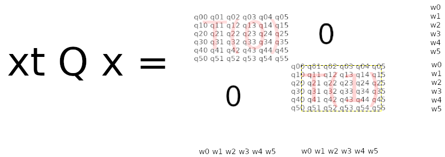

# 有关优化Minimum Snap后端优化的探究

## 基本的Minimum Snap算法

minimum snap算法在2011年被提出，来自论文***Minimum Snap Trajectory Generation and Control for Quadrotors***，算法与普遍使用的贝塞尔曲线不同，使用了多项式来描述轨迹。

### 1 核心理论：微分平坦性
Minimum Snap 算法之所以选择多项式，是因为四旋翼无人机被证明具有微分平坦性。简单来说，机器人的四个输入量（四个电机的转速）和其所有的状态量（位置、速度、加速度等），都可以仅通过位置(x,y,z)及其偏航角ψ的有限阶导数来表示。
举例来说，以下是一个轨迹以及其轨迹的n阶导数图像。  

其中：
- x坐标表示时间t。
    au=\frac{t}{T_i}
- 红线是绿线的1阶导数。其物理意义是：**机器人在某个轴上，某个时间点下的速度**。
- 蓝线是绿线的2阶导数。其物理意义是：**机器人在某个轴上，某个时间点下的加速度，对应无人机的推力方向**。
- 以此类推...  
 
### 2 为什么要最小化 Snap？
t=0\Rightarrow\tau=0,\qquad t=T_i\Rightarrow\tau=1
- 速度 (1阶)：描述飞行的快慢。
- 加速度 (2阶)：与机身的**推力方向（即姿态倾角）**相关。
- 加加速度 (3阶)：与机身的角速度相关。
- 加加加速度 (4阶)：与机身的角加速度相关，进而直接对应电机产生的力矩。

为了让飞行过程尽可能平滑，减少电机的剧烈变速和控制上的抖动，我们需要最小化控制输入的能量。由上可知，最小化 Snap 的平方积分，本质上就是在最小化电机推力的变化率，从而生成一条最节省控制能量、最“顺滑”的轨迹。  
实际使用中，其实也可以选择更低阶的低阶的多项式，低阶多项式的数值会更小一点，而且其轨迹本身也足够平坦。
### 3 算法数学建模

在 Mellinger 的原始论文中，轨迹被描述为分段多项式 (Piecewise Polynomial)。假设路径由M段多项式组成，第i段轨迹描述为：
$T_i(t)=w_0 + w_1 t + w_2 t^2 \dots + w_n t^k$  
其中：
- $T_i$：表示第i个多项式，在t时刻下的位置。
- $w_i$：表示第i个多项式系数。
- $t$：表示时间。每一段的时间从0开始。
- $k$：表示多项式阶数。根据变分法原理，如果要最小化某个函数的n阶导数（这里n=4，即 Snap），最优曲线的多项式阶数应为2n-1。在后续的闭式求解中也有妙用。

接下来就是算法的核心思想：将轨迹的n阶导（n取4对应minimum snap）的平方的积分最小化。四阶导的平方在论文中可以用来描述电机的功率，而对其在t时间内积分就是消耗的总能量。  
$\min \sum_{i=1}^M \int_{0}^{t_{i}} (T_i^{(n)}(t))^2 dt$  
其中：
- $T_i^{(n)}(t)$：表示第i个多项式第n阶导数。
- $t_{i}$：表示第i段轨迹的持续时间长度。
- $n$：表示n阶导数，在minumum snap中取4。
    
目标是最小化上面这个函数，使得轨迹平滑且总耗能最小。
然后就是约束条件。由于轨迹是每一段分别使用多项式描述的，而为了保证总轨迹平坦，需要保证两个段之间的控制点处，轨迹n阶导数连续。即前一个多项式轨迹在$t_i$处的n阶导数等于后一段多项式在0时刻的n阶导数：  
$T_{i-1}^{(0)}(t_{i-1})=T_{i}^{(0)}(0)$  
$T_{i-1}^{(1)}(t_{i-1})=T_{i}^{(1)}(0)$  
$\vdots$  
$T_{i-1}^{(m)}(t_{i-1})=T_{i}^{(m)}(0)$  
其中：
- $m$：表示到m阶导数连续。一般来说在minimum snap只需要保证前3阶导数连续即可，在论文中允许4阶导数发生跳变（电机的电流跳变）。
### 4 构造QP问题

QP问题是指二次优化问题，是一个非常常见的优化问题，因此有大量的求解器去解决这个问题。只要将minimum snap问题转化为QP问题，就可以使用QP求解器求解参数。  
一个标准的QP问题可以描述为：  
$\min \frac{1}{2} x^T Q x + c^T x$  
$s.t. \space low \leq A x \leq high$  

其中：
- $x$：表示待求解的参数，决策变量。
- $Q$：表示二次项矩阵，海森矩阵。
- $c$：表示一次项向量，线性向量。
- $low$：表示约束条件的下界。
- $high$：表示约束条件的上界。
- $A$：用于构建线性约束条件，约束矩阵。  

倒回去看看minimum snap的目标函数，看看能否转化成为QP问题的目标函数的形式。其中发现有一些比较优雅的性质：  
1. 对于k阶多项式来说，求解它的n阶导数的平方的积分很好求。
2. $\int_{0}^{t_{i}} (T_i^{(n)}(t))^2 dt$积分的结果可以使用次数为2的多项式函数$F([w_0, w_1 \dots, w_k])(t=t_*, t_* \in [0, t_{i}])$表示，即能够被$x^T Q x$表示。
3. 以上方法得到的Q矩阵半正定，目标函数是凸的。  

#### 构造决策变量x

我们将第i段的轨迹的多项式参数设置为$x_i=[w_0, w_1 \dots, w_k]^T$，一共需要M段，直接拼接$x_i$可以得到x，其形状为$[M * (k+1), 1]$。  内容就是：$[x_0[w_0, w_1 \dots, w_k], x_1[w_0, w_1 \dots, w_k], ... ,x_{M-1}[w_0, w_1 \dots, w_k]]$

#### 构造海森矩阵Q

可以将Q矩阵分块，以每块的形状为$[k+1, k+1]$，一共M*M块。每一块都表示两个控制点中间的一段轨迹。为了不让两段轨迹之间有影响，可以置非对角的块为0。如下图所示：  
  
而求解的时候则是：
  
只要使得每块都表示每一段的轨迹的积分，经过矩阵乘法，后即可得到全部积分的和，就是目标函数。因此，需要解决如何构造子矩阵sub_Q，使得每块可以表示为轨迹的n阶导数的平方的积分。  
再看minimum snap每一段的的目标函数  
$\int_{0}^{t_{i}} (T_i^{(n)}(t))^2 dt$  
如果将$t_i$进行预分配，那么在构造Q的时候将$t_i$作为常量传入，整个积分中的参数就只有$w_i$。经过计算后，得到：  
<!-- $ subQ_{a,b} = A_a^n \cdot A_b^n \cdot \frac{{t_i}^{a+b-2\times n+1}}{a+b-2\times n+1} $    -->
$
\mathrm{subQ}_{a,b} = 
\begin{cases}
A_a^n \cdot A_b^n \cdot \dfrac{t_i^{a+b-2n+1}}{a+b-2n+1} & \text{if } a + b - 2n + 1 \geq 0, \\
0 & \text{otherwise}.
\end{cases}
$  
其中：
- $a$：表示子矩阵的行数。
- $b$：表示子矩阵的列数。
- $n$：表示n阶导数。
- $A_a^n$：表示下降阶乘，等于$\frac{a!}{(a-n)!}$。当a < n时，则$A_a^n=0$  

写成代码就是：
```cpp
        MatXd sub_Q = MatXd::Zero(order, order);
        // 遍历多项式的每一项
        for (int i = maxdx; i < order; i++) {
            for (int l = i; l < order; l++) {
                // l=i或者l=maxdx效果都一样
                // 积分（pow（四阶导））|0到dt
                sub_Q(i, l) = Axx(i, maxdx) * Axx(l, maxdx) * powf(timeAllocated[k], i + l - 2 * maxdx + 1) / (i + l - 2 * maxdx + 1);
            }
        }
```
举例来说，当固定t_i = 0.5时，n=4阶导，7次多项式的子矩阵subQ可以被构造为：  
$
\mathbf{subQ} = 
\begin{bmatrix}
0 & 0 & 0 & 0 & 0 & 0 & 0 & 0 \\
0 & 0 & 0 & 0 & 0 & 0 & 0 & 0 \\
0 & 0 & 0 & 0 & 0 & 0 & 0 & 0 \\
0 & 0 & 0 & 0 & 0 & 0 & 0 & 0 \\
0 & 0 & 0 & 0 & 288 & 360 & 360 & 315 \\
0 & 0 & 0 & 0 & 360 & 600 & 675 & 630 \\
0 & 0 & 0 & 0 & 360 & 675 & 810 & 787.5 \\
0 & 0 & 0 & 0 & 315 & 630 & 787.5 & 787.5
\end{bmatrix}
\ or
\begin{bmatrix}
0 & 0 & 0 & 0 & 0 & 0 & 0 & 0 \\
0 & 0 & 0 & 0 & 0 & 0 & 0 & 0 \\
0 & 0 & 0 & 0 & 0 & 0 & 0 & 0 \\
0 & 0 & 0 & 0 & 0 & 0 & 0 & 0 \\
0 & 0 & 0 & 0 & 288 & 720 & 720 & 630 \\
0 & 0 & 0 & 0 & 0 & 600 & 1350 & 1260 \\
0 & 0 & 0 & 0 & 0 & 0 & 810 & 1575 \\
0 & 0 & 0 & 0 & 0 & 0 & 0 & 787.5
\end{bmatrix}
$  
详细推导就不写了，正常来说海森矩阵要求是对称的，但是有些求解器内部会自动纠正，所以这里就不做处理了。  
另外，由于$x^T Q x$已经可以完整描述整个minimum snap的目标函数，因此不需要再构造c向量，二次型前面的1/2也可以化简掉了。  
#### 构造线性约束条件A、up、low

有了目标函数后，我们需要把物理限制（如路点、连续性）转化为数学上的线性约束，统一写成双边不等式形式：  
$ \mathbf{low} \le \mathbf{A}\mathbf{x} \le \mathbf{up} $  
矩阵 $\mathbf{A}$ 的构造逻辑对应代码中的分块操作，主要包含以下两部分：
1.  **位置约束**：
    约束第1段轨迹在 $t=0 or t=t_k$ 时的位置。即每一段轨迹的起点/终点必须经过控制点。起点终点有其一即可，因为后面连续性约束会将他们再次约束到同一个点上。位置直接根据算式  
    $ T_i(t) = w_0 + w_1 t + w_2 t^2 \dots + w_n t^k $  
    带入t得到矩阵A每一行的系数。一共M+1个控制点，因此这一部分A矩阵的行数是M+1。由于是硬约束，对应的low与up的值都是控制点对应轴的坐标。  

2.  **连续性约束**：
    保证相邻两段轨迹在连接处平滑过渡，即：**第 $k$ 段末尾的状态 = 第 $k+1$ 段开头的状态**。
    *   对应矩阵行：同时操作两段系数。第 $k$ 段对应列填入 $t=T_k$ 的系数（正），第 $k+1$ 段对应列填入 $t=0$ 的系数（负）。
    *   通常涵盖 0 到 order-2 阶导数（位置、速度、加速度、Jerk等）。  
    例如当$t_{i}=2.0$，n=4阶导但是只需要0~2阶连续时，位于第i段轨迹末尾、第i+1段轨迹开头的A矩阵可以构造为：  
    $
    \begin{bmatrix}
    1 & 2 & 4 & 8 & -1 & 0 & 0 & 0 \\
    0 & 1 & 4 & 12 & 0 & -1 & 0 & 0 \\
    0 & 0 & 2 & 12 & 0 & 0 & -2 & 0
    \end{bmatrix}
    $
### 5 解决问题

至此，$\mathbf{Q}, \mathbf{A}, \mathbf{low}, \mathbf{up}$ 均已构造完毕，问题转化为标准的二次规划（QP）问题，输入求解器即可得到对应轴的求解结果x。  

只要分别对每一个坐标轴求解（如x、y、z），然后将求解结果进行采样，即可得到轨迹。

## 闭式求解优化的Minimum Snap

2016年的论文***Polynomial Trajectory Planning for Aggressive Quadrotor Flight in Dense Indoor Environments***
提到了对于Minimum Snap这样构造的QP问题是一种硬约束的QP问题，可以使用闭式求解求解，大体的思路就是直接不依赖于通用的QP问题求解器，而是直接将约束条件变成变量，构造方程组直接求解得到最优结果，无需迭代。

闭式求解Minimum Snap最大的优点是，一步得到结果，速度很快，而且轨迹最优。

算法的另一个创新点在于，它为了数值稳定性，对时间分配进行了归一化操作。我尝试复现了这个归一化过程，但是发现最终的求解结果与不进行归一化的结果并不一致，而且相对较差，因此采用了原始的时间分配方式，在后续的算法改进中我也尝试自己去解决归一化问题，最终的优化结果比不进行归一化的结果要好很多。

### 碰撞的处理
两篇论文对碰撞的处理都差不多，都是先直接进行一次规划，然后对生成的轨迹进行碰撞检测，如果检测到碰撞，那么就简单的在这段轨迹的中间插入一个控制点，直到轨迹中没有碰撞。这个方法简单但是非常有效。后续的交替迭代求解就是基于这个方法上拓展的。

## 优化的Minimum Snap

以上的Minimum Snap的已经是一个很完备的优化模型了，但是其中有一个比较明显的优化方向：
1. Minimum Snap算法有一个特性就是它优化出来的结果必须经过前端给出的控制点，也就是说如果前端的控制点质量不行的话，后端的优化将非常困难。
2. Minimum Snap算法在构建问题时没将障碍物纳入问题，求解出来的路径会撞墙。
3. Minimum Snap算法开到4阶（snap）及以上的时候，容易出现数值不稳定导致求解失败的问题。

为了解决以上两个问题，我对应引入了以下优化：
1. 借鉴了哈工大2024导航开源的思路，引入了方形安全飞行走廊约束。
2. 使用迭代的方式优化每一次迭代的约束，进一步避免轨迹碰撞障碍物。
3. 引入了时间分配的归一化，使得时间分配更稳定，避免了数值不稳定导致求解失败的问题。

### 方形安全飞行走廊
构建方形安全飞行走廊的优化解决的问题是控制点优化的问题，它的做法是不再将控制点看做一个固定的点，而是一个方形的区域，只要轨迹经过这个区域内即可，弱化了控制点相关的约束。  

方形飞行走廊的构造逻辑就是，找到包含当前控制点的最大的正方形，不要求控制点位于正方形的中心，只要控制点在正方形内即可。使用正方形的原因而非矩形最主要的目的是避免矩形向长、向宽方向搜索的多解问题，使用方形也相对来说更不容易在采样时发生碰撞。

虽然它的名字叫“方形安全飞行走廊”，但是实际上它并不是真正的安全飞行走廊，因为从问题构造的角度上看，它并不能保证轨迹不与障碍物发生碰撞，也不能保证走廊是相接的，更何况使用真正的走廊约束其实是没法线性化表示的，也就是说将优化构建为Minimum Snap的形式是没法用上飞行走廊的。

### 交替迭代求解
迭代的作用是防止后端生成的轨迹发生碰撞。相比于将复杂的障碍物一条条写成线性的走廊、边界约束，不如直接将问题从工程的角度出发，把解决问题的方式放到Minimum Snap求解之外，以牺牲时间反复试错，来达到解决轨迹碰撞的目的。

迭代求解的核心思路是在多项式上采样轨迹并结合地图进行碰撞检测，然后对发生碰撞的轨迹段单独进行处理，处理完成后再次送入求解过程重新得到曲线，如此反复迭代循环，直到轨迹没有发生碰撞为止。实现细节如下：
1. 首先对原始轨迹进行求解，得到多项式并采样得到轨迹点。
2. 对采样得到的轨迹点进行碰撞检测，如果检测到碰撞，那么将会有两个可选的处理方式，在迭代过程中交替使用：
    - 强约束方式，直接在发生碰撞的轨迹段中间插入一个控制点，重新进行求解。
    - 弱约束方式，减少发生碰撞的轨迹段时间分配，减少轨迹自由优化的范围，使得多项式更加接近于保证不发生碰撞的前端轨迹点。
3. 添加完约束后，将构造好的新问题送回到求解器，前往1进行下一轮迭代。

由于不管是闭式求解还是osqp的admm求解，他们都是在对线性问题进行求解，相比基于梯度的非线性优化来说会快很多，迭代的开销是可接受的，而且换来的轨迹质量的提升是非常值得的。

### 时间分配的归一化
时间分配的归一化是为了避免数值不稳定导致求解失败的问题。

#### 为什么需要对时间进行归一化

前面构造多项式时，使用的是每一段自己的物理时间$t$。假设第i段的持续时间为$T_i$，那么这一段的时间范围就是$[0,T_i]$。当不同分段的时间差异比较大时，高阶多项式中的$t^k$会带来很大的数值差异。例如某一段的时间比较长时，$T_i^5$、$T_i^6$等高次项会迅速变大，而另一段的时间比较短时，对应的高次项又会非常小。这样构造出来的Q矩阵和A矩阵中，不同列的数量级可能相差很多，求解器在处理这些矩阵时就容易出现矩阵病态、求解精度下降甚至求解失败的问题。

时间归一化的做法是给每一段单独引入一个局部时间变量，使这一段的时间范围固定为$[0,1]$。原先的时间分配$T_i$仍然保留，它继续表示这一段真实经过的秒数；变化的只是多项式内部采用的时间坐标。

#### 将物理时间换成归一化时间

对于第i段轨迹，定义归一化时间：

$$
	au=\frac{t}{T_i}
$$

因此：

$$
t=0\Rightarrow\tau=0,\qquad t=T_i\Rightarrow\tau=1
$$

原来的多项式使用物理时间t表示：

$$
p_i(t)=a_0+a_1t+a_2t^2+\dots+a_kt^k
$$

换成归一化时间以后，使用另一组系数b表示同一条曲线：

$$
p_i(\tau)=b_0+b_1\tau+b_2\tau^2+\dots+b_k\tau^k
$$

将$\tau=t/T_i$带回去，可以得到两组系数之间的关系：

$$
b_j=a_jT_i^j,\qquad a_j=\frac{b_j}{T_i^j}
$$

这个关系说明，同一条物理轨迹可以用两组不同的系数表示。使用$a_j$时，自变量是物理时间$t$；使用$b_j$时，自变量是局部时间$\tau$。当$t$与$\tau$按照上面的关系对应时，两种表示给出的空间位置完全相同。

归一化功能由一个开关控制。关闭时，求解变量使用物理时间$t$；开启时，每一段使用自己的$\tau$。时间分配本身始终保留，因此速度约束仍然使用原来的物理单位。

#### 归一化以后Q矩阵的构造

归一化以后，首先要处理导数随时间变量变化产生的缩放。根据链式法则：

$$
\frac{d}{dt}=\frac{1}{T_i}\frac{d}{d\tau}
$$

因此，r阶物理导数满足：

$$
\frac{d^rp_i}{dt^r}=\frac{1}{T_i^r}\frac{d^rp_i}{d\tau^r}
$$

以最大化代价的maxdx阶导数为例，积分中的$dt$也需要一起替换：

$$
\begin{aligned}
\int_0^{T_i}\left(\frac{d^{maxdx}p_i}{dt^{maxdx}}\right)^2dt
&=\int_0^1\left(T_i^{-maxdx}\frac{d^{maxdx}p_i}{d\tau^{maxdx}}\right)^2T_i\,d\tau\\
&=T_i^{1-2maxdx}\int_0^1\left(\frac{d^{maxdx}p_i}{d\tau^{maxdx}}\right)^2d\tau
\end{aligned}
$$

归一化多项式的积分范围固定为0到1，所以Q矩阵中的时间幂次项得到简化，结果为：

$$
\mathrm{subQ}_{a,b}=
\begin{cases}
T_i^{1-2maxdx}\cdot A_a^{maxdx}\cdot A_b^{maxdx}\cdot\dfrac{1}{a+b-2maxdx+1} & a,b\geq maxdx,\\
0 & \text{otherwise}.
\end{cases}
$$

归一化以后，时间幂次的底数固定在$[0,1]$内，Q矩阵中由高次幂造成的数量级差异会明显减小。不同分段之间仍然存在$T_i^{1-2maxdx}$带来的物理权重差异，这个权重必须保留，因为较长或较短的分段对导数平方积分的贡献本来就不同。

在送入OSQP之前，还会对整个Q矩阵除以其中绝对值最大的项。这个操作只改变目标函数的整体倍数，不改变满足约束条件时各个解之间的优劣关系，因此不会改变最优解。

目标函数中还加入了一个一阶系数的距离惩罚项。未归一化时，它对应$0.01a_1^2$；由于$a_1=b_1/T_i$，归一化以后需要写成：

$$
0.01a_1^2=\frac{0.01}{T_i^2}b_1^2
$$

因此归一化后的Q矩阵需要给$b_1^2$增加$0.01/T_i^2$的权重，使这个附加项在变量替换前后表达相同的物理意义。（虽然这个本身并不证明有显著效果）

#### 归一化以后A矩阵的构造

Q矩阵负责描述优化目标，A矩阵负责描述位置、连续性和速度等约束。归一化以后，位置约束需要在归一化时间的位置上进行评价。由于每一段的起点和终点分别对应$\tau=0$和$\tau=1$，因此位置约束的形式变成：

$$
p_i(\tau)=b_0+b_1\tau+b_2\tau^2+\dots+b_k\tau^k
$$

特别是每一段终点的位置约束，直接在$\tau=1$处构造A矩阵。这样可以避免把较大的$T_i$代入$t^k$以后产生很大的高次幂。

连续性约束的逻辑不变，仍然是前一段的末状态等于后一段的初状态：

$$
\frac{d^rp_i}{dt^r}(T_i)=\frac{d^rp_{i+1}}{dt^r}(0)
$$

但是两边在构造矩阵时都要使用物理导数。根据前面的导数变换，第r阶导数对应的A矩阵需要乘以$T_i^{-r}$：

$$
T_i^{-r}\frac{d^rp_i}{d\tau^r}(1)-T_{i+1}^{-r}\frac{d^rp_{i+1}}{d\tau^r}(0)=0
$$

因此，构造第a阶导数约束时需要同时完成两步：先根据$\tau=ip/segment\_t$得到归一化位置，再用$segment\_t^{-a}$把第a阶导数换回物理单位。时间变量完成了归一化，导数仍然必须回到物理时间下进行比较，否则连续性约束只在归一化坐标下成立，物理速度、加速度和Jerk则会出现错误。

途经点速度约束也需要使用物理速度。因为：

$$
v=\frac{dp}{dt}=\frac{1}{T_i}\frac{dp}{d\tau}
$$

而在$\tau=0$处，归一化多项式的一阶导数中只有$b_1$这一项有效，所以速度约束对应的A矩阵系数为$1/T_i$，未归一化时则为1。这样设置以后，速度约束仍然使用原来的物理单位，不需要为了打开归一化功能而修改速度输入。

#### 求解以后如何恢复实际轨迹

归一化求解得到的是每一段关于$\tau$的系数b，时间分配仍然是每一段真实的持续时间$T_i$。采样时，在$\tau\in[0,1]$内取样，然后将$\tau$带入归一化多项式：

$$
p_i(\tau)=\sum_{j=0}^{k}b_j\tau^j
$$

关闭归一化时，采样变量改为物理时间$t\in[0,T_i]$。因此两种模式描述的是同一段物理时间，只是多项式系数和自变量有所区别。采样结果统一转换成实际的二维坐标后，再拼接为整条路径。

#### 整个归一化流程

将整个过程总结起来，开启归一化时的执行步骤如下：

1. 首先通过时间分配得到每一段的实际持续时间$T_i$，这个时间仍然以秒为单位，不参与修改。
2. 对第i段定义$\tau=t/T_i$，将这一段的时间范围从$[0,T_i]$换成$[0,1]$。
3. 使用归一化时间构造Q矩阵，snap代价乘上$T_i^{1-2maxdx}$，并根据$b_1=T_i a_1$换算一阶系数惩罚项。
4. 使用$\tau=0$或$\tau=1$构造位置约束，使用$T_i^{-r}d^r/d\tau^r$构造物理导数约束。
5. 对构造好的Q矩阵和A矩阵进行必要的数值缩放，再交给闭式求解后端或OSQP后端求解。
6. 求解结束后，在$[0,1]$内对归一化多项式采样，得到坐标点并拼接成最终轨迹。

所以，时间归一化的核心是对每一段的时间变量进行换元，并且在目标函数、导数约束和采样过程中补上相应的$T_i$缩放。Q矩阵负责保留时间对代价的影响，A矩阵负责保留时间对物理导数的影响，采样过程负责把归一化变量还原到正确的分段轨迹。三者需要使用同一套变量变换，归一化前后的轨迹才具有一致的物理意义。只把$t$替换成$\tau$而忽略导数和积分的变化，会得到数值形式看起来正常、物理速度和高阶导数却已经错误的结果。

### 速度约束
速度约束的目的其实是为了应对特殊的场景设计的，它可以从轨迹上直接约束车辆经过这个位置时的速度。这个功能在比如过洞的时候、上下台阶需要对准的时候，除了画一个抽象的地图，从障碍物的角度约束以外的更加数学而非民科的解决方案。

速度约束的原理是直接限制轨迹在控制点处的一阶导数。设第i段轨迹为：

$$
p_i(t)=a_0+a_1t+a_2t^2+\dots+a_kt^k
$$

那么该段在时刻$t$的速度为：

$$
v_i(t)=\frac{dp_i(t)}{dt}=a_1+2a_2t+\dots+ka_kt^{k-1}
$$

因此，只需要在对应位置将速度表达式加入约束矩阵A，并将上下界设置为同一个速度值，就可以把速度固定为指定值：

$$
v_{min}=v_{max}=v_i
$$

速度约束按x、y两个方向分别求解。起点速度使用第一段在$t=0$处的一阶导数，终点速度使用最后一段在$t=T_{M}$处的一阶导数。途经点速度使用后一段在$t=0$处的一阶导数；由于相邻两段的一阶导数已经通过连续性约束相等，所以使用哪一侧表示都可以。

没有指定速度的控制点，对应速度约束的上下界设置为负无穷和正无穷，不参与限制。设置了速度的控制点，同时会将该点的位置约束固定为控制点坐标，这样速度和位置约束就会在同一个连接点处生效。

使用归一化时间时，$t=T_i\tau$，所以物理速度为：

$$
v_i=\frac{1}{T_i}\frac{dp_i}{d\tau}
$$

此时途经点位于后一段的$\tau=0$处，只有一次项系数有效，对应A矩阵中的系数为$1/T_i$。因此输入的速度值始终是物理速度，不需要因为时间归一化而改变单位。

## 写在最后

使用全图随机取点，1000次测试，前端质量，整个算法的性能表现如下：
| Map | Method | waypoints | Average(us) | Max(us) |
| ---| --- | --- | --- | --- |
| RMUC2024 | OSQPCorridor | astar + 势场 | 1248.45 | 15940.3 |
| RMUC2024 | Close | astar + 势场 | 125.046 | 598.123 |
| RMUC2024 | OSQPCorridor | jps | 5580.33 | 179106 |
| RMUC2024 | Close | jps{1} | 1107.9 | 90131.5 |
| RMUC2025 | OSQPCorridor | astar + 势场 | 6052.95 | 204404 |
| RMUC2025 | Close | astar + 势场 | 694.975 | 6757.24 |
| RMUC2025 | OSQPCorridor | jps | 6418.13 | 113289 |
| RMUC2025 | Close | jps{1} | 1198.77 | 18144.8 |

{1}: 闭式求解不建议使用jps作为前端，因为质量很差基本不可优化。

其实这种基于线性minimum snap有很大的局限性，最主要的缺陷在于它需要满足线性的约束、二次的损失条件，它没能将障碍物写进约束、时间写到损失内，写成这样基本已经到头了。与之相比使用基于梯度的后端优化算法上限会高很多，可以自由设计想要的损失，而不是为了达成某个条线反复打补丁，而且能够因为建模原因得以一次性求解得到结果，求解速度与多轮迭代相比基本没有区别甚至更快。